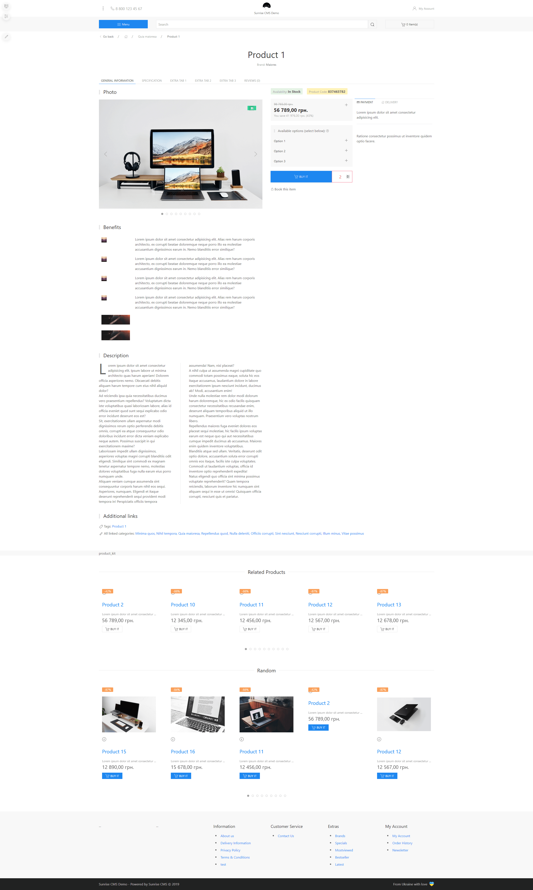

# Sunrise CMS


[](https://travis-ci.com/Nickbur/Sunrise_CMS_Project)

[](https://www.gnu.org/licenses/gpl-3.0)

> **Warning!**
> This is **not a release** or even a test build. The project is **in development** and sooner or later it will be ready.

This is a free open source solution for creating online stores, blogs, informational sites, one-page sites or landing pages.
The project is based on the Opencart code base and its custom builds, but there are no plans to follow their roadmap, maintain backward compatibility, or even the internal structure. Sunrise CMS provides lightning-fast response and speed even when working with large amounts of data.

## Demo
* [Frontend](https://sunrise-cms.freelance-team.su/)   
* [Backend](https://sunrise-cms.freelance-team.su/admin/) (login: ```admin```, password: ```dev```)

## Screenshots
Main page* | Catalog page* | Product page* | Checkout page*
--- | --- | --- | ---
 |  |  | 

Cart* | Menu*
--- | ---
 | 

> *Work in progress is shown. Images will be updated periodically.

## Speed test and page analysis

PageSpeed Insights | GTmetrix | Pingdom
--- | --- | ---
Main ([mobile](https://developers.google.com/speed/pagespeed/insights/?hl=en&url=https%3A%2F%2Fsunrise-cms.freelance-team.su%2F&tab=mobile), [desktop](https://developers.google.com/speed/pagespeed/insights/?hl=en&url=https%3A%2F%2Fsunrise-cms.freelance-team.su%2F&tab=desktop))  | [Main](https://gtmetrix.com/reports/sunrise-cms.freelance-team.su/iCjNMebl)  | [Main](https://tools.pingdom.com/#5a6179a502400000)  
Catalog ([mobile](https://developers.google.com/speed/pagespeed/insights/?hl=en&url=https%3A%2F%2Fsunrise-cms.freelance-team.su%2Fnulla-deleniti%2F), [desktop](https://developers.google.com/speed/pagespeed/insights/?hl=en&url=https%3A%2F%2Fsunrise-cms.freelance-team.su%2Fnulla-deleniti%2F&tab=desktop))  | [Catalog](https://gtmetrix.com/reports/sunrise-cms.freelance-team.su/AOuGvyme)  | [Catalog](https://tools.pingdom.com/#5a617990d5000000)  
Product ([mobile](https://developers.google.com/speed/pagespeed/insights/?hl=en&url=https%3A%2F%2Fsunrise-cms.freelance-team.su%2Fproduct-1.html&tab=mobile), [desktop](https://developers.google.com/speed/pagespeed/insights/?hl=en&url=https%3A%2F%2Fsunrise-cms.freelance-team.su%2Fproduct-1.html&tab=desktop))  | [Product](https://gtmetrix.com/reports/sunrise-cms.freelance-team.su/XP1FZEqj)  | [Product](https://tools.pingdom.com/#5a61794635c00000)

## Support and discussion
* [Issue Tracker](https://github.com/Nickbur/Sunrise_CMS_Project/issues)  
  * [Report a bug](https://github.com/Nickbur/Sunrise_CMS_Project/issues/new?assignees=&labels=bug%2C+help+wanted%2C+invalid&template=bug_report.md&title=%5BBUG%5D+...)  
  * [Feature request](https://github.com/Nickbur/Sunrise_CMS_Project/issues/new?assignees=&labels=enhancement&template=feature_request.md&title=)  
* [Official forum](https://freelance-team.su/forum/2-sunrise-cms/)

## Install
1. Move ```/dist/``` contents to your webroot
2. Edit ```$domain``` value in ```catalog/config/domain.php``` and ```admin/config/domain.php```
3. Edit your database settings in ```catalog/config/db.php``` and ```admin/config/db.php```
4. Import ```cms.sql```

## Requirements
* Apache Web Server *(v2.4 recommended)*  
* PHP 7.2+ *(v7.3 recommended)*  
* MySQL 5.6+ *(v8.0 recommended)*  
* Fast file storage or Redis *(Redis recommended)*

## .htaccess
```
RewriteEngine On  
RewriteBase /  
RewriteRule ^system/storage/(.*) index.php?route=error/not_found [L]  
RewriteCond %{REQUEST_FILENAME} !-f  
RewriteCond %{REQUEST_FILENAME} !-d  
RewriteCond %{REQUEST_URI} !.*\.(ico|gif|jpg|jpeg|png|js|css)  
RewriteRule ^([^?]*) index.php?_route_=$1 [L,QSA]
```

## Author

* *Current main developer:* Mykola Burakov burakov.work@gmail.com

## Join the development
Feel free to join the project, we need your help! See [CONTRIBUTING](https://github.com/Nickbur/Sunrise_CMS_Project/blob/master/CONTRIBUTING.md) and [pull_request_template](https://github.com/Nickbur/Sunrise_CMS_Project/blob/master/pull_request_template.md) for more information.

## License
  
[GNU General Public License v3.0](https://github.com/Nickbur/Sunrise_CMS_Project/blob/master/LICENSE)
